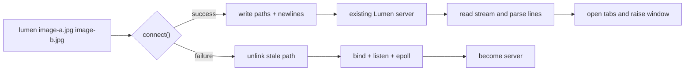
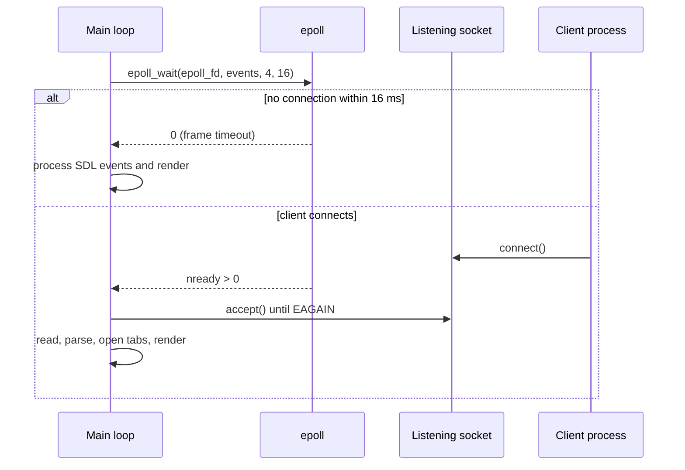
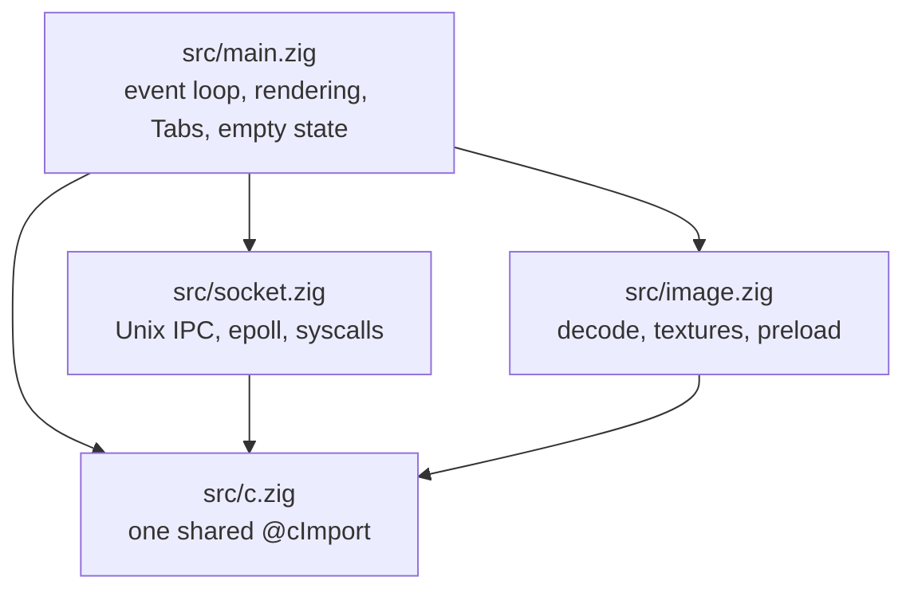

# Lumen Architecture and Development Log

Lumen is a minimal, single-window image viewer written in Zig and SDL2. Its
most important behavioral guarantee is that repeated launches do not create
multiple windows: the first process owns the window and later processes hand
their image paths to it over a local Unix-domain socket.

This document records the implementation in the order it was developed. It is
both an architecture guide for maintainers and a rationale for the low-level
Linux and Zig choices in the codebase.

## 1. Starting point: the original IPC design

The original `src/main.zig` was a 591-line single file. It implemented the
single-instance behavior directly:

1. Resolve the per-user socket path.
2. When image paths are present, try to connect to an existing server.
3. If the connection succeeds, send the paths and exit.
4. If the connection fails, become the server and create the SDL window.
5. While rendering, accept handoffs and add their paths as tabs.

The server sends paths as newline-delimited UTF-8 bytes. A stream socket does
not preserve application-level messages, so the newline is the framing
boundary. The server retains incomplete input in a pending buffer until a
complete line arrives.



### Why Unix-domain sockets

A Unix-domain socket is the appropriate transport because:

- **Local-only:** it cannot be reached over the network, and does not need an
  IP address or port allocation.
- **Ordered and reliable:** `SOCK_STREAM` provides a reliable ordered byte
  stream, which makes newline framing straightforward.
- **Filesystem address:** the endpoint is a path such as
  `/run/user/1000/lumen.sock`, making discovery and cleanup explicit.
- **Normal permissions:** access is governed by filesystem and runtime-directory
  permissions rather than by a custom authentication protocol.

### `sockaddr_un` and the address length

On Linux, the relevant address layout is:

```c
struct sockaddr_un {
    sa_family_t sun_family;  /* 2 bytes on Linux */
    char        sun_path[108]; /* path, including the terminator */
};
```

The length passed to `bind()` and `connect()` is the length of the populated
address, not `sizeof(sockaddr_un)`:

```zig
const addr_len: std.posix.socklen_t = @intCast(
    @sizeOf(std.posix.sa_family_t) + spath.len + 1,
);
```

The `+ 1` accounts for the null terminator. Passing the complete structure size
would include unused bytes after the path and is technically the wrong address
length. The formula is named `addr_len` and is used consistently by the client
and server.

The path is checked against the 108-byte `sun_path` capacity. An overlong path
returns `error.SocketPathTooLong` instead of silently continuing toward a
confusing `bind()` or `connect()` failure.

### Runtime directory and stale sockets

The preferred endpoint is `$XDG_RUNTIME_DIR/lumen.sock`. A runtime directory is
per-user, temporary, and normally permission-protected, which makes it a good
location for an IPC endpoint. On systems without `XDG_RUNTIME_DIR`, Lumen uses
`/tmp/lumen-<uid>.sock`; including the UID prevents users from accidentally
sharing one pathname.

The socket is a filesystem entry. If the previous process crashed, the file can
remain even though no socket is listening. The next server must unlink the stale
path before `bind()`, otherwise the kernel reports the address as already in use.
Normal shutdown also closes both descriptors and unlinks the socket.

### Raw Linux syscall return values in Zig

The IPC code uses `std.os.linux.*` directly rather than libc wrappers. Raw Linux
syscalls return `usize`:

- success is a non-negative result, often a file descriptor or byte count;
- failure is the bitwise representation of `-(errno)` in the unsigned return
  type.

This differs from libc, where a wrapper returns `-1` and stores the actual
`errno` in thread-local state. The distinction matters when inspecting a
syscall result: the code must bit-cast the `usize` to `isize` before checking
its sign.

## 2. Correctness and code-quality improvements

Four helpers centralize the raw syscall rules in `src/socket.zig`:

```zig
pub fn syscallOk(r: usize) bool {
    return @as(isize, @bitCast(r)) >= 0;
}

pub fn syscallFd(r: usize) error{Syscall}!i32 {
    if (@as(isize, @bitCast(r)) < 0) return error.Syscall;
    return @intCast(r);
}

pub fn isEintr(r: usize) bool {
    return @as(isize, @bitCast(r)) ==
        -@as(isize, @intCast(@intFromEnum(std.posix.E.INTR)));
}
```

`syscallOk` handles boolean success checks, while `syscallFd` validates and
extracts a descriptor without repeating casts at every call site.

`EINTR` is errno 4, meaning that a signal interrupted the syscall. It is not a
connection or data error; the operation should be retried. The `accept()` and
`read()` loops retry on `EINTR`. Without that behavior, a signal arriving
mid-frame could make the server abandon a client or silently lose a handoff.

The `writeAll()` helper addresses the separate short-write issue:

```zig
pub fn writeAll(fd: i32, data: []const u8) void {
    var remaining = data;
    while (remaining.len > 0) {
        const written = @as(isize, @bitCast(
            std.os.linux.write(fd, remaining.ptr, remaining.len),
        ));
        if (written <= 0) break;
        remaining = remaining[@intCast(written)..];
    }
}
```

`write()` may return after writing only part of the requested buffer, for
example when the kernel buffer is nearly full. Looping over the remaining slice
keeps the helper correct for arbitrary payload sizes.

## 3. Syscall efficiency

### `writev`: from `2N` writes to one

The first client implementation called `write()` once for every path and once
for every newline. Sending `N` paths therefore required `2N` write syscalls.
The client now builds an iovec array:

```text
[path-1, "\n", path-2, "\n", ... path-N, "\n"]
```

`writev()` submits the complete vector in one syscall, reducing the handoff
write cost from `2N` to one syscall. When the complete payload fits in the
socket buffer, the vector also has the useful atomicity property that the
handoff is not interleaved with another write on that connection. The server
still treats the result as a stream and parses newlines, because stream framing
must remain correct even when payloads are larger than a single kernel write.

### `SOCK_NONBLOCK`: removing two `fcntl` calls

The old setup was:

```text
socket()
fcntl(F_GETFL)
fcntl(F_SETFL, flags | O_NONBLOCK)
```

Linux 2.6.27 and later allow `SOCK_NONBLOCK` in the `socket()` type argument:

```zig
std.os.linux.socket(
    std.posix.AF.UNIX,
    std.posix.SOCK.STREAM | std.posix.SOCK.NONBLOCK,
    0,
)
```

The new setup is one syscall instead of three. It also removes the window
between `socket()` and `fcntl()` in which another thread could observe or use a
blocking descriptor.

### `epoll` replaces polling plus `SDL_Delay`

The old event loop called `accept()` every frame and then slept:

```text
every frame:
    accept()             # almost always EAGAIN
    render
    SDL_Delay(16)
```

At 60 frames per second this performs about 3,600 needless `accept()` syscalls
per idle minute. Because the listening descriptor is non-blocking, an `accept()`
with no waiting client returns immediately with `EAGAIN`. That is safe but is
still wasted polling.

The replacement is an epoll-backed server:



Initialization performs:

1. `epoll_create1(0)` to create the epoll instance.
2. `epoll_ctl(ADD, server_fd, EPOLLIN)` to register the listening socket.
3. `epoll_wait(epoll_fd, events, 4, 16)` on each loop iteration.

The 16 ms timeout serves two purposes: it wakes the loop for approximately
60 fps, and it wakes early when a handoff is ready. `SDL_Delay(16)` is therefore
removed. `accept()` is called only after epoll reports readiness, then drains
all queued clients until non-blocking `accept()` returns `EAGAIN`. `EINTR` is
retried in both the accept and read loops.

### Why not `io_uring`

`io_uring` exposes shared submission and completion rings between user space and
the kernel. A program fills submission queue entries and uses one
`io_uring_enter` call to submit many operations and optionally wait for
completions. With `IORING_SETUP_SQPOLL`, a kernel thread can poll the submission
ring, reducing submission syscalls for sustained workloads.

It is not a useful trade for Lumen:

- At idle, epoll already costs one blocking syscall per frame. A viewer still
  needs one kernel wait for the frame timer, so io_uring cannot reduce that
  below one.
- Socket handoffs are rare events, not a connection-throughput bottleneck.
- The dominant work is JPEG/STB decoding on the CPU and SDL GPU rendering;
  io_uring does not accelerate either.

io_uring is better suited to high-connection-rate servers, batch file-I/O
pipelines, and zero-copy networking. Lumen's epoll design removes the actual
idle polling problem without adding a more complex asynchronous I/O model.

## 4. Module architecture

The monolithic file was split into four focused modules:



### `src/c.zig`

This file is intentionally only about eight lines: it performs one `@cImport`
and exports it as `pub const c`. Every module imports that declaration:

```zig
const c = @import("c.zig").c;
```

Zig's `@cImport` produces an anonymous C type. Two separate `@cImport`
expressions can therefore produce incompatible anonymous types even when they
include the same headers. Sharing one declaration is essential for passing
values such as `*c.SDL_Texture` and `*c.SDL_Renderer` between modules.

### `src/socket.zig`

This 186-line module owns all Linux IPC details:

- raw syscall helpers and `EINTR` handling;
- runtime socket-path selection;
- client-side `tryHandoff(allocator, spath, args)`;
- the non-blocking `Server` type.

`Server.init(spath)` unlinks the stale path, creates the non-blocking Unix
socket, binds and listens, creates epoll, and registers the listening fd.
`deinit(spath_z)` closes the epoll and socket descriptors and removes the
filesystem endpoint.

`Server.poll(allocator, pending, read_buf, timeout_ms) !bool` is the event-loop
boundary. It wraps `epoll_wait`, drains ready connections, retries interrupted
syscalls, reads each client to EOF, and appends bytes to the caller-owned
pending buffer. It returns whether any data arrived; partial lines remain in
`pending` for the next call.

### `src/image.zig`

This 265-line module owns image decoding and texture creation. JPEG files use
libjpeg-turbo; other supported formats fall back to stb_image. The public
`Image` value contains an SDL texture and its dimensions.

`Preload` is a one-slot background decode cache. Its layout deliberately places
the hot fields first:

```text
hot:  data, w, h       # inspected on every loadImage cache check
cold: path, mutex, thread
```

`preloadNext` uses a deliberate lock protocol:

1. Lock and check whether a decode is already in flight or the requested path
   is already cached.
2. Replace stale cache state, duplicate the path, and mark the operation
   in-flight.
3. Unlock **before** `Thread.spawn`, so the worker can acquire the mutex when
   decoding finishes.
4. Spawn the worker.
5. Relock, publish `preload.thread`, and unlock.

This function must not use a blanket `defer unlock`: it intentionally unlocks
and relocks around thread creation, so a deferred unlock would run at the wrong
point. `cleanup()` joins the preload thread and frees cached pixel data during
shutdown.

### `src/main.zig`

The entry point now contains the SDL event loop, image rendering, tab UI,
window/icon setup, and empty-state behavior. It coordinates `socket.Server` and
`image.Image` without owning their low-level implementation details.

## 5. Data-oriented tab storage

Rendering and mouse hit-testing used to call `TTF_SizeUTF8` for every open tab
on every frame. With ten tabs at 60 fps, that is 600 measurements per second
for values that rarely change.

`main.zig` now uses a `Tabs` structure with two parallel arrays:

```text
paths[i]  : [:0]const u8  # owned, null-terminated path
widths[i] : i32           # cached pixel width
```

`append` measures a basename once with `TTF_SizeUTF8`, adds tab padding and the
close-button gutter, and stores the result. Rendering and hit-testing read
`widths[i]` directly, producing zero font measurements per frame.

The append operation is also failure-safe. It duplicates the path, calls
`ensureTotalCapacity` on **both** arrays before changing either visible length,
then uses `appendAssumeCapacity` on each. If either capacity allocation fails,
neither array has been partially appended. `removeAt(i)` uses `orderedRemove(i)`
on both arrays in the same operation, preserving the invariant that the arrays
always have identical lengths and indexes.

This is a small but practical example of data-oriented design: hot computed
data (`widths`) is stored separately from cold source data (`paths`), computed
once, and reused across the frame loop.

### Closing the requested tab

The original `closeTabAt` always removed `index.*`, the currently selected tab,
regardless of which close button was clicked. The mouse handler now passes the
loop variable as `target: usize`, so the button under the pointer determines
which tab is removed.

### Keydown state

Navigation key handling previously used a `changed` flag plus a separate
`new_index` variable. It now uses one `?usize` expression: `null` means no
navigation occurred, while a value is the new selected index. This keeps the
state transition local and avoids a second piece of mutable bookkeeping.

## 6. Empty-state behavior

The application no longer exits early when `args.len < 2`. It always opens a
window:

- with image arguments, it loads the requested images normally;
- without arguments, it shows an empty window;
- after the final tab closes, it stays alive and returns to the empty state.

The empty state has two centered lines:

```text
No images open
lumen <file.jpg> [file.jpg ...]
```

The first uses muted grey (`#a0a0a0`); the second is a dim hint line. The
`renderCenteredText(renderer, font, text, color, cx, cy)` helper owns the
repeated sequence of rendering text, creating an SDL texture, centering it,
drawing it, and freeing it. `renderEmptyState(renderer, window, font)` composes
the two lines.

This changes the IPC lifecycle in a useful way. Running `lumen` with no
arguments creates an empty server window. Later `lumen image.jpg` invocations
connect to that server and add tabs instead of opening another window.

## 7. Icon design and embedding

Four icon concepts were explored in a live canvas: Aperture, Prism, Lens, and
Monogram L. The selected concept was **Lens**.

`assets/lumen.svg` uses a dark, glass-like palette:

| Element | Color / opacity |
|---|---|
| Rounded square background | `#1A1B2E` |
| Outer lens body | `#252840` fill, `#454878` stroke |
| Middle glass element | `#1C1F40` fill, `#5860A0` stroke |
| Inner bright element | `#6870D8`, opacity `0.6` |
| Centre | `#AABCFF`, opacity `0.7` |
| Specular highlight | white, opacity `0.18`, top-left |

The highlight is intentionally placed top-left to give the lens a three-
dimensional glass feel.

The SVG is rasterized with `rsvg-convert` into:

- `assets/lumen-64.png`, embedded for the SDL window icon;
- `assets/lumen-48.png`, installed for desktop icon themes;
- `assets/lumen-256.png`, installed for desktop icon themes;
- `src/lumen-icon.png`, a copy used by Zig's compile-time embedding.

The copy must live under `src/`. Zig 0.16's `@embedFile` only accepts paths
within the package path rooted at the root source file; `../assets/lumen-64.png`
is rejected at compile time. `setWindowIcon` therefore uses:

```zig
const bytes = @embedFile("lumen-icon.png");
```

Those bytes are decoded with `stbi_load_from_memory(..., desired_channels=4)`,
wrapped in an `SDL_CreateRGBSurfaceWithFormatFrom` surface using
`SDL_PIXELFORMAT_RGBA32`, passed to `SDL_SetWindowIcon`, and then released.

On little-endian x86, `SDL_PIXELFORMAT_RGBA32` is equivalent to
`SDL_PIXELFORMAT_ABGR8888` and stores memory bytes in `[R][G][B][A]` order,
which matches stb_image's four-channel output.

## 8. Build process and installation

### Zig version management

The project is pinned to Zig 0.16.0 through `mise.toml`:

```toml
[tools]
zig = "0.16.0"
zls = "0.16.0"
```

The machine also had a `0.17.0-dev` binary at
`/home/bernard/.local/share/zig/zig`. The build must use the mise-managed
toolchain, either through the mise shim or by putting the mise installation
ahead of that development binary in `PATH`.

### GCC 16 `.sframe` workaround

GCC 16 emits `.sframe` sections in `crt1.o`, `crti.o`, and `crtn.o`. Those
sections contain `R_X86_64_PC64` relocations that the Zig 0.16 linker cannot
process. `build-gcc16.sh` works around the incompatibility without modifying
system files:

1. Use `objcopy --remove-section .sframe --remove-section .rela.sframe` to
   create stripped copies under `/tmp/stripped/`.
2. Enter a private user and mount namespace with
   `unshare --map-root-user --mount`; no real root privileges are required.
3. Bind-mount the stripped CRT files over the originals inside that namespace.
4. Run `zig build` in the namespace.

The namespace disappears after the script exits, so the host's CRT files remain
unchanged.

### Artifact sizes

The resulting sizes are:

- Debug: approximately 11 MB, including unoptimized code and debug information.
- `ReleaseFast`: approximately 3.8 MB, with Zig's optimizer and stripping,
  including the embedded PNG bytes.

### Installation on Arch Linux / Omarchy

Omarchy is Arch Linux-based, so system dependencies are installed with
`pacman`. The project links against SDL2, SDL2_ttf, libjpeg-turbo, and uses
`rsvg-convert` to generate the PNG icon assets:

```bash
sudo pacman -S --needed sdl2 sdl2_ttf libjpeg-turbo librsvg
```

Zig is managed by `mise` and pinned to 0.16.0 in `mise.toml`. Install and
activate the pinned toolchain before building:

```bash
mise install
mise exec -- zig version
```

The expected version is `0.16.0`. This matters on Omarchy systems that also
have a development Zig binary installed elsewhere. If the `mise` shim is not
already active in the shell, build through `mise exec` or put the mise-managed
Zig directory first in `PATH`.

On current Arch systems with GCC 16, use the repository workaround rather than
running `zig build` directly:

```bash
./build-gcc16.sh -Doptimize=ReleaseFast
```

The script strips incompatible `.sframe` sections from temporary copies of the
CRT objects and bind-mounts them inside a private user/mount namespace. It
does not modify `/usr/lib` on the host. On systems without the GCC 16/Zig 0.16
linker incompatibility, the normal build is sufficient:

```bash
mise exec -- zig build -Doptimize=ReleaseFast
```

Install the release binary and icons using the system hicolor theme:

```bash
sudo install -m 755 /home/bernard/Projects/imgv/zig-out/bin/imgv \
  /usr/local/bin/lumen

# SVG (scalable)
sudo mkdir -p /usr/share/icons/hicolor/scalable/apps
sudo cp /home/bernard/Projects/imgv/assets/lumen.svg \
  /usr/share/icons/hicolor/scalable/apps/lumen.svg

# PNGs
for size in 48 64 256; do
  sudo mkdir -p "/usr/share/icons/hicolor/${size}x${size}/apps"
  sudo cp "/home/bernard/Projects/imgv/assets/lumen-${size}.png" \
    "/usr/share/icons/hicolor/${size}x${size}/apps/lumen.png"
done

# Refresh icon cache
sudo gtk-update-icon-cache -f /usr/share/icons/hicolor
```

The 48, 64, and 256 pixel variants are installed under their corresponding
hicolor directories, while the SVG is installed in the scalable directory.
`/usr/local/bin` is the conventional location for locally built commands and
should already be on an Omarchy user's `PATH`.

The user desktop entry should reference the installed icon name rather than a
generic placeholder. Update
`~/.local/share/applications/lumen.desktop`:

```bash
sed -i 's/^Icon=image-x-generic$/Icon=lumen/' \
  ~/.local/share/applications/lumen.desktop
```

The desktop entry should invoke `/usr/local/bin/lumen %F`, where `%F` is
important: it asks the file manager to pass all selected files to one
invocation. The single-instance socket then ensures that even separate
invocations converge on the same Lumen window. Refresh the desktop application
database or log out and back in only if the desktop environment does not
immediately notice the changed desktop entry.

## 9. Current module and runtime contract

The architecture can be summarized as a small set of explicit contracts:

| Boundary | Contract |
|---|---|
| Client → socket server | newline-delimited path bytes over a reliable local stream |
| Raw Linux syscall → Zig | inspect signed bit-cast; retry `EINTR`; treat fd and byte counts explicitly |
| `Server` → main loop | `poll` blocks up to the frame timeout and appends received bytes |
| `Tabs` | `paths` and `widths` always have identical lengths and indexes |
| Preload worker → renderer | worker owns decode work; mutex-protected pixel cache is consumed by `loadImage` |
| Build → desktop | binary is `imgv`, installed command is `lumen`, icon and desktop files use the `lumen` identity |

The result is intentionally modest: one process, one SDL window, one local IPC
endpoint, and a small amount of background work. The refactoring removes
unnecessary syscall and font-measurement work while keeping the hot rendering
loop easy to follow. More importantly, each subsystem now has a narrow owner:
Linux IPC in `socket.zig`, image memory and decoding in `image.zig`, shared C
types in `c.zig`, and UI orchestration in `main.zig`.
